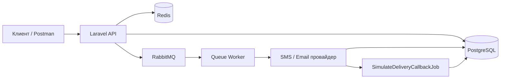

<p align="center"><a href="https://laravel.com" target="_blank"></a></p>

# Сервис уведомлений

Микросервис для асинхронной отправки SMS и Email. API принимает запросы, сохраняет уведомления в базу и ставит их в очередь RabbitMQ. Воркер отправляет сообщения через **mock-провайдеры** (по умолчанию) или через **Twilio** / **SendGrid** — переключается в `.env`.

**Стек:** Laravel 13, PostgreSQL, Redis, RabbitMQ, Sanctum, Twilio, SendGrid.

---

## Быстрый старт

```bash
# 1. Скопируй env (если ещё не сделано)
cp .env.example .env

# 2. Запусти все сервисы
docker compose up -d

# 3. Дождись, пока app станет healthy
docker compose ps
```

При первом запуске контейнер `app` автоматически:
- установит зависимости (`composer install`, `npm install`);
- выполнит миграции;
- сгенерирует API-токен (`POSTMAN_API_TOKEN` в `.env`).

API будет доступен на **http://localhost:8000**.

---

## Сервисы

| Сервис | Адрес | Назначение |
|--------|-------|------------|
| API | http://localhost:8000 | HTTP-интерфейс |
| RabbitMQ UI | http://localhost:15673 | Мониторинг очередей |
| PostgreSQL | localhost:5433 | База данных |
| Redis | localhost:6380 | Идемпотентность, кеш |
| pgAdmin | http://localhost:8081 | UI для PostgreSQL |

Логи воркера:

```bash
docker compose logs -f worker
```

---

## Как это работает



1. Клиент отправляет POST-запрос с Bearer-токеном и заголовком `Idempotency-Key`.
2. API проверяет идempotентность (Redis), создаёт записи в БД со статусом `queued`, кладёт job в RabbitMQ.
3. Воркер обрабатывает job, вызывает провайдер (mock, Twilio или SendGrid), меняет статус на `sent`.
4. Отложенный callback-job меняет статус на `delivered`.
5. Клиент запрашивает историю через GET и видит актуальные статусы.

---

## Авторизация

Все эндпоинты защищены Sanctum. В каждом запросе нужен заголовок:

```
Authorization: Bearer {POSTMAN_API_TOKEN}
```

Токен лежит в `.env` после старта контейнера. Перегенерировать:

```bash
docker compose exec app php artisan api:token:generate
```

---

## API

Базовый URL: `http://localhost:8000/api/v1`

### Создать подписчика

```http
POST /subscribers
```

```json
{
  "external_id": "user-demo",
  "phone": "+79001234567",
  "email": "demo@example.com"
}
```

**Ответ `201`:**
```json
{
  "subscriber": {
    "id": 1,
    "external_id": "user-demo",
    "phone": "+79001234567",
    "email": "demo@example.com",
    "created_at": "..."
  }
}
```

---

### Отправить одно уведомление

```http
POST /notifications
Idempotency-Key: unique-key-1
```

```json
{
  "subscriber_external_id": "user-demo",
  "channel": "sms",
  "priority": "transactional",
  "message": "Код доступа: 4821"
}
```

**Ответ `202`:**
```json
{
  "notification": {
    "id": 1,
    "status": "queued",
    "channel": "sms",
    "message": "Код доступа: 4821",
    "priority": "transactional",
    "created_at": "..."
  }
}
```

---

### Массовая рассылка

```http
POST /notifications/bulk
Idempotency-Key: unique-key-2
```

```json
{
  "subscriber_external_ids": ["user-demo", "user-2"],
  "channel": "email",
  "priority": "marketing",
  "message": "Специальное предложение!"
}
```

**Ответ `202`:**
```json
{
  "batch_id": 1,
  "channel": "email",
  "priority": "marketing",
  "message": "Специальное предложение!",
  "total_count": 2,
  "notifications": [ ... ]
}
```

---

### История уведомлений подписчика

```http
GET /subscribers/{external_id}/notifications?status=delivered&per_page=20
```

**Ответ `200`** — стандартная Laravel-пагинация (`data`, `links`, `meta`).

Query-параметры:
- `status` — фильтр: `queued`, `sent`, `delivered`, `failed`
- `per_page` — записей на страницу (1–100, по умолчанию 20)

---

## Справочник значений

### Каналы (`channel`)

| Значение | Описание |
|----------|----------|
| `sms` | SMS-сообщение |
| `email` | Email-сообщение |

### Приоритеты (`priority`)

| Значение | Очередь RabbitMQ | Когда использовать |
|----------|------------------|--------------------|
| `transactional` | `notifications.high` | Коды доступа, срочные алерты |
| `normal` | `notifications` | Обычные уведомления |
| `marketing` | `notifications.low` | Маркетинговые рассылки |

Срочные сообщения обрабатываются раньше маркетинговых за счёт отдельных очередей.

### Статусы (`status`)

| Значение | Описание |
|----------|----------|
| `queued` | Принято, ждёт обработки воркером |
| `sent` | Отправлено провайдеру |
| `delivered` | Доставлено (симуляция callback) |
| `failed` | Ошибка отправки |

---

## Провайдеры отправки (Twilio / SendGrid)

Код провайдеров уже в проекте. Переключение — через переменные в `.env`. Конфиг: `config/notifications.php`.

### Драйверы

| Переменная | Значения | По умолчанию |
|------------|----------|--------------|
| `NOTIFICATION_SMS_DRIVER` | `mock`, `twilio` | `mock` |
| `NOTIFICATION_EMAIL_DRIVER` | `mock`, `sendgrid` | `mock` |

`NotificationProviderResolver` выбирает реализацию по каналу и драйверу:

| Канал | mock | Реальный провайдер |
|-------|------|--------------------|
| `sms` | `SmsProviderMock` | `TwilioSmsProvider` |
| `email` | `EmailProviderMock` | `SendGridEmailProvider` |

**Mock** — задержка 50–200 мс, без внешних запросов. Удобно для локальной разработки и PHPUnit-тестов.

**Twilio / SendGrid** — реальные HTTP-запросы к API. Нужны ключи и контакты подписчика (`phone` для SMS, `email` для Email).

### Переменные окружения

```env
# Драйверы (mock — для разработки, twilio/sendgrid — для боевой отправки)
NOTIFICATION_SMS_DRIVER=mock
NOTIFICATION_EMAIL_DRIVER=mock

# Twilio (SMS)
TWILIO_SID=your_account_sid
TWILIO_TOKEN=your_auth_token
TWILIO_FROM=+15005550006

# SendGrid (Email)
SENDGRID_API_KEY=your_api_key
SENDGRID_FROM_EMAIL=noreply@example.com
SENDGRID_FROM_NAME="${APP_NAME}"
SENDGRID_DEFAULT_SUBJECT=Notification
SENDGRID_SANDBOX_MODE=true
```

`SENDGRID_SANDBOX_MODE=true` — письмо не уходит получателю, SendGrid только валидирует запрос (удобно для проверки интеграции).


### Ошибки провайдеров

| Исключение | Поведение |
|------------|-----------|
| `TemporaryProviderException` (HTTP 429/5xx, таймаут) | Job повторяется (до 3 попыток, backoff 10/30/60 сек) |
| `PermanentProviderException` (нет phone/email, HTTP 4xx) | Статус `failed`, повторов нет |

В mock-сообщениях можно симулировать ошибки:
- `__fail_temporary__` в тексте — временная ошибка
- `__fail_permanent__` в тексте — постоянная ошибка

### Статус `delivered`

После успешной отправки провайдером job `SimulateDeliveryCallbackJob` через ~3 секунды переводит статус в `delivered`. Для реальных Twilio/SendGrid это упрощённая симуляция webhook; в проде здесь был бы обработчик callback от провайдера.

---

## Идемпотентность

POST-запросы на отправку требуют заголовок `Idempotency-Key`.

- Первый запрос с ключом — создаёт уведомление.
- Повтор с тем же ключом — возвращает тот же ответ, дубликат в БД не создаётся.
- Без ключа — **422**.

---

## Коды ответов

| Код | Когда |
|-----|-------|
| `200` | Успешный GET |
| `201` | Подписчик создан |
| `202` | Уведомление принято в очередь |
| `401` | Нет или неверный Bearer-токен |
| `404` | Подписчик не найден |
| `409` | Запрос с этим ключом уже обрабатывается |
| `422` | Ошибка валидации |

---

## Postman

Готовая коллекция:

```
postman/Notification-Service.postman_collection.json
```

**Импорт:** Postman → Import → выбрать файл.

**Настройка:**
1. Скопировать `POSTMAN_API_TOKEN` из `.env` в переменную коллекции `token`.
2. Запустить папку **«Полный сценарий»** по порядку (шаг 0 → 1 → … → 4).

---

## Ручная проверка (E2E)

```bash
# 1. Запустить проект
docker compose up -d

# 2. Создать подписчика
curl -X POST http://localhost:8000/api/v1/subscribers \
  -H "Authorization: Bearer $POSTMAN_API_TOKEN" \
  -H "Content-Type: application/json" \
  -d '{"external_id":"user-demo","phone":"+79001234567","email":"demo@example.com"}'

# 3. Отправить SMS
curl -X POST http://localhost:8000/api/v1/notifications \
  -H "Authorization: Bearer $POSTMAN_API_TOKEN" \
  -H "Idempotency-Key: demo-1" \
  -H "Content-Type: application/json" \
  -d '{"subscriber_external_id":"user-demo","channel":"sms","priority":"transactional","message":"Код: 4821"}'

# 4. Подождать 5–10 сек, проверить статус
curl "http://localhost:8000/api/v1/subscribers/user-demo/notifications" \
  -H "Authorization: Bearer $POSTMAN_API_TOKEN"
```

Ожидаемый результат: статус сменится `queued` → `sent` → `delivered`.

---

## Тесты

```bash
# В Docker
docker compose exec app php artisan test

# Локально (нужен PHP 8.3+)
php artisan test
```

12 feature-тестов: создание подписчиков, отправка, идемпотентность, 404, пагинация, фильтры.  
PHPUnit использует SQLite in-memory; RabbitMQ при тестах не нужен (`Queue::fake()`).

---

## Структура проекта

```
app/
├── Domain/              # Модели, enums, контракты
│   ├── Notification/
│   └── Subscriber/
├── Infrastructure/      # Репозитории, Redis, провайдеры (mock / Twilio / SendGrid)
├── Application/         # Сервисы, jobs, DTO
└── Http/                # Controllers, Requests, Resources, Responses

docker/
├── setup/
│   ├── entrypoint.sh         # app: migrate, token, dev-server
│   └── worker-entrypoint.sh  # worker: queue:work

postman/                 # Postman-коллекция
tests/Feature/Api/       # Feature-тесты API
```

---

## Полезные команды

```bash
docker compose up -d                          # Запуск
docker compose down                           # Остановка
docker compose exec app php artisan migrate   # Миграции вручную
docker compose exec app php artisan api:token:generate  # Новый токен
docker compose logs -f worker                 # Логи воркера
docker compose exec app php artisan tinker    # REPL
```
